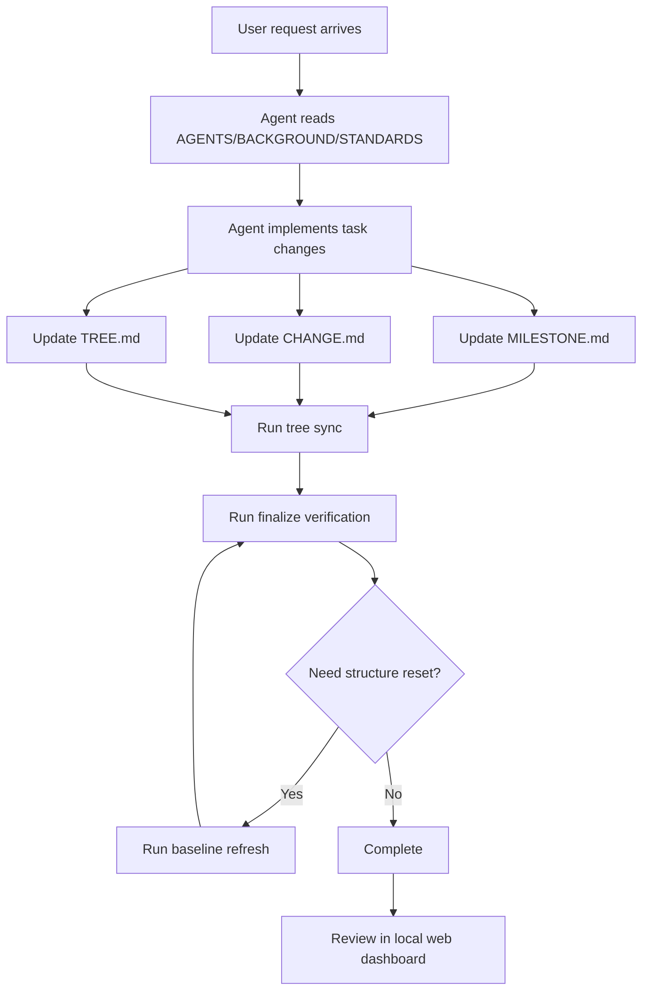
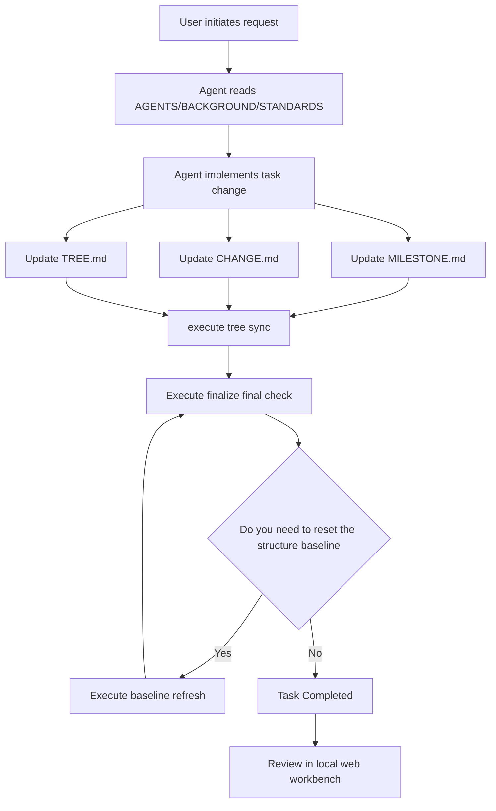

# AAAAAAGENTS.MD

A bilingual starter workspace for building and running AGENTS.md-driven projects with deterministic scripts and a local visualization dashboard.

Quick language jump: [English](#english) | [Chinese](#Chinese)

## English

### Introduction

`AAAAAAGENTS.MD` is a practical bootstrap for teams that want to manage AI-agent collaboration through explicit markdown rules, repeatable scripts, and visible project state.

It keeps constraints, milestones, changes, and file-tree metadata in sync, then validates everything through one final command.

### Why It Exists

- Teams need one clear rule entry instead of scattered conventions.
- Agent workflows need deterministic verification, not manual guessing.
- Project context should be visible in both text and UI views.
- Structural updates should be traceable through milestones and change logs.
- Initialization should be reusable across future projects.

### How It Works

Mermaid flow (source: [`agents_docs/diagrams/how_it_works.mmd`](agents_docs/diagrams/how_it_works.mmd))

### Prompt Templates

- Initialization template: [`agents_docs/prompts/init_prompt_template.md`](agents_docs/prompts/init_prompt_template.md)
- Daily conversation template: [`agents_docs/prompts/daily_prompt_template.md`](agents_docs/prompts/daily_prompt_template.md)

### Quick Start

1. Install dependencies:
   - `pip install -r requirements.txt`
2. Launch local dashboard:
   - Windows: `./start_web.bat`
   - Linux/WSL: `./start_web.sh`
   - Python: `python ./start_web.py`
3. Typical maintenance commands:
   - `python agents_tools/tree.py sync`
   - `python agents_tools/baseline_refresh.py`
   - `python agents_tools/verify_rules.py finalize --json`

Note: This README is for users/developers. Runtime agent constraints are defined in [`AGENTS.md`](AGENTS.md).

### Screenshots

Capture guide: [`agents_assets/screenshots/SCREENSHOTS_GUIDE.md`](agents_assets/screenshots/SCREENSHOTS_GUIDE.md)

Standard screenshot slots (placeholders):

- Overview: `agents_assets/screenshots/01-overview.png`
- Milestone flow: `agents_assets/screenshots/02-milestone-flow.png`
- Tree explorer: `agents_assets/screenshots/03-tree-explorer.png`
- Edit mode: `agents_assets/screenshots/04-edit-mode.png`

## Chinese

### Project introduction

`AAAAAAGENTS.MD` is a general initialization workspace for the AGENTS.md collaboration model. The goal is to unify rules, execution, verification and visualization into a set of reusable processes.

It uses structured documents and scripts to make project status trackable, verifiable, and replayable.

### Why exists

- The team needs a unified entrance to the rules to avoid scattered verbal agreements.
- Agent execution requires deterministic verification instead of manual guessing.
- The project context needs to support both document viewing and visual viewing.
- Structural changes need to be continuously settled through milestones and change records.
- Initialization capabilities need to be reusable for subsequent new projects.

### How it works

Flow chart (source code: [`agents_docs/diagrams/how_it_works.mmd`](agents_docs/diagrams/how_it_works.mmd))

### Prompt word template

- Initialization template: [`agents_docs/prompts/init_prompt_template.md`](agents_docs/prompts/init_prompt_template.md)
- Daily dialogue template:[`agents_docs/prompts/daily_prompt_template.md`](agents_docs/prompts/daily_prompt_template.md)

### Quick activation

1. Install dependencies:
   - `pip install -r requirements.txt`
2. Start the local workbench:
   - Windows:`./start_web.bat`
   - Linux/WSL:`./start_web.sh`
   - Python:`python ./start_web.py`
3. Common maintenance commands:
   - `python agents_tools/tree.py sync`
   - `python agents_tools/baseline_refresh.py`
   - `python agents_tools/verify_rules.py finalize --json`

Note: README is for users/developers; Agent running constraints are subject to [`AGENTS.md`](AGENTS.md).

### Screenshot

Shooting and replacement instructions:[`agents_assets/screenshots/SCREENSHOTS_GUIDE.md`](agents_assets/screenshots/SCREENSHOTS_GUIDE.md)

Standard screenshot placeholder (currently only declared, no picture is generated):

- Overview page:`agents_assets/screenshots/01-overview.png`
- Milestone flow chart:`agents_assets/screenshots/02-milestone-flow.png`
- File tree explorer:`agents_assets/screenshots/03-tree-explorer.png`
- Edit mode:`agents_assets/screenshots/04-edit-mode.png`

