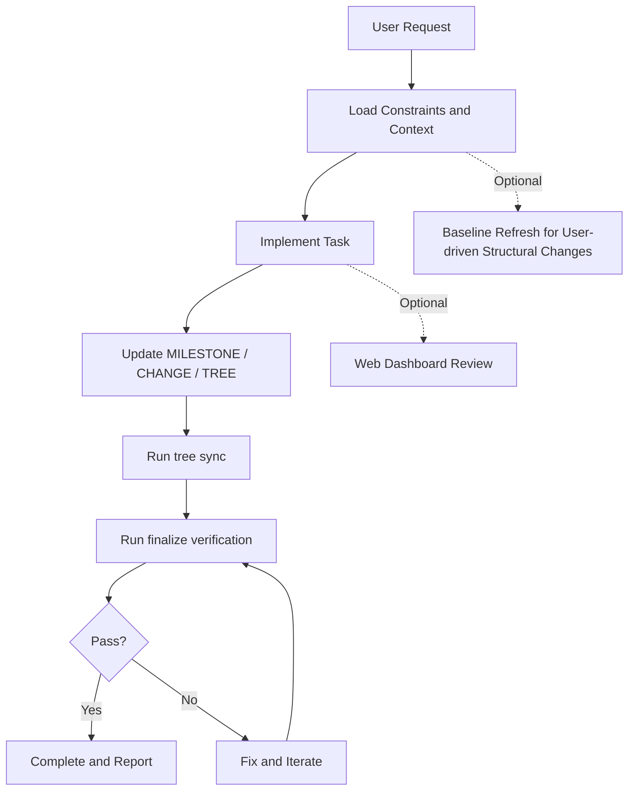

<div align="center">

<h1>AAAAAAGENTS.MD</h1>

<p><strong>Bring constraints, milestones, changes, repository structure, and verification into one executable and traceable collaboration workspace</strong></p>

<p>
  
  
  
  

</p>

<p>
  <a href="#project-snapshot">Snapshot</a> ·
  <a href="AAAAAAGENTS.MD.CN/AGENTS.md">Chinese workspace</a> ·
  <a href="AAAAAAGENTS.MD.EN/AGENTS.md">English workspace</a> ·
  <a href="CONTRIBUTING.md">Contributing</a> ·
  <a href="LICENSE">License</a>
</p>

<p><a href="README.md">简体中文</a> · <a href="README.en.md">English</a></p>

</div>

<a id="project-snapshot"></a>

## 1 Project snapshot

This section separates the former combined bilingual document into a Chinese primary README and an English mirror while preserving its features, workflows, commands, screenshot slots, and adoption boundaries

<div align="center">

Table 1.1 Public project overview

| Item | Current value |
|---|---|
| Chinese workspace | `AAAAAAGENTS.MD.CN` |
| English workspace | `AAAAAAGENTS.MD.EN` |
| Governance core | `AGENTS.md`, `MILESTONE.md`, `CHANGE.md`, and `TREE.md` |
| Automation | Tree sync, baseline refresh, and final verification |
| Visualization | Repository-local dashboard with no public deployment address required |
| License | See [`LICENSE`](LICENSE) |

</div>

## 2 Introduction

`AAAAAAGENTS.MD` is a rule-driven project governance workspace for AI-assisted development.
It combines:

- constraint documents (`AGENTS.md`, `MILESTONE.md`, `CHANGE.md`, `TREE.md`)
- deterministic automation scripts (`agents_tools`)
- local visualization dashboard (`agents_web`)

English workspace path: `./AAAAAAGENTS.MD.EN`

## 3 Why It Exists

- Keep agent execution bounded, traceable, and auditable
- Convert verbal collaboration rules into executable checks
- Standardize milestone progress and change logging
- Reduce project bootstrap and handover friction
- Improve project cognition granularity so both AI and human users can read, understand, and collaborate on the same structure

## 4 How It Works

<div align="center">



Figure 4.1 Rule documents, execution modes, and the validation loop

</div>

## 5 Prompt Templates

### 5.1 Initialization Prompt

```markdown
# Use the following content as one complete prompt
# The following paragraph continues this task specification
Read `AGENTS.md` first, then build the initial global understanding from `BACKGROUND.md`, `TREE.md`, and existing project files. Follow the workflow and recording contracts defined in `AGENTS.md`, execute only within authorized scope, and treat all project standards, milestone rules, and validation rules as the single source of execution truth.
```

### 5.2 Daily Prompt

```markdown
# Use the following content as one complete prompt
# The following paragraph continues this task specification
Locate the `MILESTONE` node required by this task, execute strictly by `AGENTS.md` workflow, and complete update-record-verify closure in one run. Do not rely on detailed user prompt decomposition; instead, implement based on the structured rules and records defined in project documents.
```

## 6 Quick Start

```bash
# English workspace
cd AAAAAAGENTS.MD.EN # Perform the operation described in this section

# start local web dashboard
python ./start_web.py # Perform the operation described in this section
# or
./start_web.sh # Perform the operation described in this section
# or (Windows)
./start_web.bat # Perform the operation described in this section

# maintenance commands
python agents_tools/tree.py sync # Perform the operation described in this section
python agents_tools/baseline_refresh.py # Perform the operation described in this section
python agents_tools/verify_rules.py finalize --json # Perform the operation described in this section
```

## 7 Screenshots

Expected screenshot slots (English):

- `01-overview.png`
- `02-milestone-flow.png`
- `03-tree-explorer.png`
- `04-edit-mode.png`
