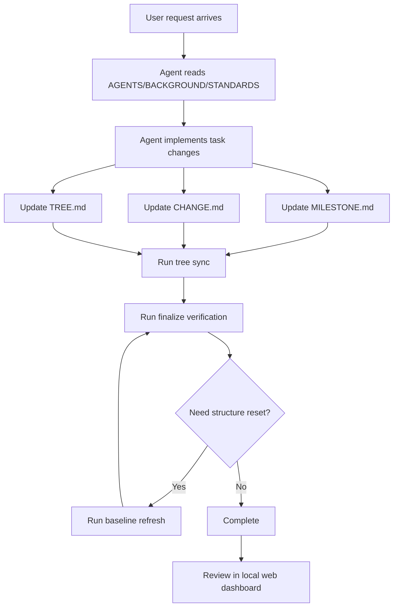
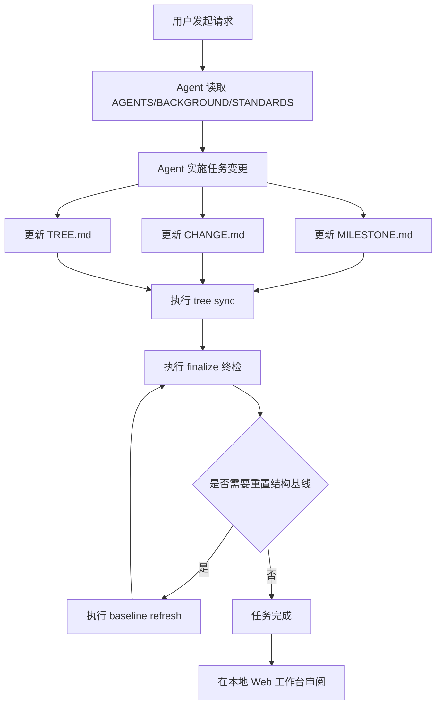

# AAAAAAGENTS.MD

A bilingual starter workspace for building and running AGENTS.md-driven projects with deterministic scripts and a local visualization dashboard.

Quick language jump: [English](#english) | [中文](#中文)

## English

### Introduction

`AAAAAAGENTS.MD` is a practical bootstrap for teams that want to manage AI-agent collaboration through explicit markdown rules, repeatable scripts, and visible project state.

It keeps constraints, milestones, changes, and file-tree metadata in sync, then validates everything through one final command.

### Why It Exists

- Teams need one clear rule entry instead of scattered conventions.
- Agent workflows need deterministic verification, not manual guessing.
- Project context should be visible in both text and UI views.
- Structural updates should be traceable through milestones and change logs.
- Initialization should be reusable across future projects.

### How It Works

Mermaid flow (source: [`docs/diagrams/how_it_works.mmd`](docs/diagrams/how_it_works.mmd))

### Prompt Templates

- Initialization template: [`docs/prompts/init_prompt_template.md`](docs/prompts/init_prompt_template.md)
- Daily conversation template: [`docs/prompts/daily_prompt_template.md`](docs/prompts/daily_prompt_template.md)

### Quick Start

1. Install dependencies:
   - `pip install -r requirements.txt`
2. Launch local dashboard:
   - Windows: `./start_web.bat`
   - Linux/WSL: `./start_web.sh`
   - Python: `python ./start_web.py`
3. Typical maintenance commands:
   - `python agents_tools/tree.py sync`
   - `python agents_tools/baseline_refresh.py`
   - `python agents_tools/verify_rules.py finalize --json`

Note: This README is for users/developers. Runtime agent constraints are defined in [`AGENTS.md`](AGENTS.md).

### Screenshots

Capture guide: [`assets/screenshots/README.md`](assets/screenshots/README.md)

Standard screenshot slots (placeholders):

- Overview: `assets/screenshots/01-overview.png`
- Milestone flow: `assets/screenshots/02-milestone-flow.png`
- Tree explorer: `assets/screenshots/03-tree-explorer.png`
- Edit mode: `assets/screenshots/04-edit-mode.png`

## 中文

### 项目介绍

`AAAAAAGENTS.MD` 是一个面向 AGENTS.md 协作模式的通用初始化工作区，目标是把规则、执行、校验和可视化统一到一套可复用流程里。

它通过结构化文档和脚本，让项目状态可追踪、可验证、可回放。

### 为什么存在

- 团队需要一个统一的规则入口，避免口头约定分散。
- Agent 执行需要确定性校验，而不是人工猜测。
- 项目上下文需要同时支持文档查看和可视化查看。
- 结构变化需要通过里程碑和变更记录持续沉淀。
- 初始化能力需要可复用到后续新项目。

### 如何工作

流程图（源码：[`docs/diagrams/how_it_works.mmd`](docs/diagrams/how_it_works.mmd)）

### 提示词模板

- 初始化模板：[`docs/prompts/init_prompt_template.md`](docs/prompts/init_prompt_template.md)
- 日常对话模板：[`docs/prompts/daily_prompt_template.md`](docs/prompts/daily_prompt_template.md)

### 快速启用

1. 安装依赖：
   - `pip install -r requirements.txt`
2. 启动本地工作台：
   - Windows：`./start_web.bat`
   - Linux/WSL：`./start_web.sh`
   - Python：`python ./start_web.py`
3. 常用维护命令：
   - `python agents_tools/tree.py sync`
   - `python agents_tools/baseline_refresh.py`
   - `python agents_tools/verify_rules.py finalize --json`

说明：README 面向用户/开发者；Agent 运行约束以 [`AGENTS.md`](AGENTS.md) 为准。

### 屏幕截图

拍摄与替换说明：[`assets/screenshots/README.md`](assets/screenshots/README.md)

标准截图占位（当前仅声明，不生成图片）：

- 总览页：`assets/screenshots/01-overview.png`
- 里程碑流程图：`assets/screenshots/02-milestone-flow.png`
- 文件树浏览：`assets/screenshots/03-tree-explorer.png`
- 编辑模式：`assets/screenshots/04-edit-mode.png`
