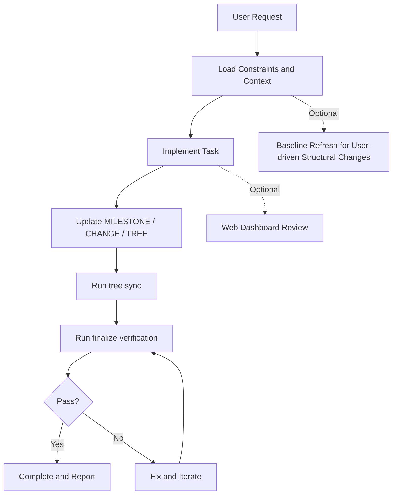
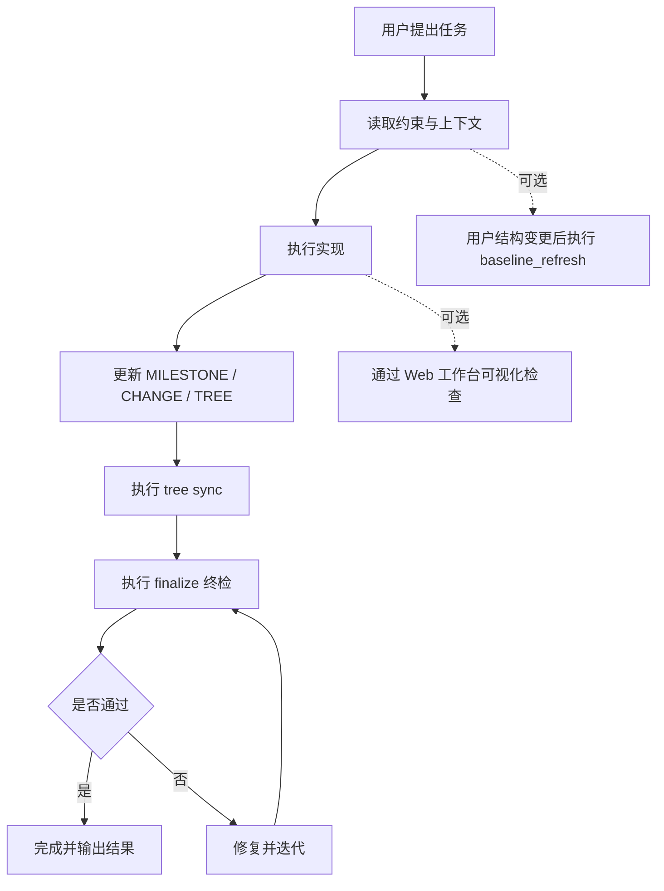

# AAAAAAGENTS.MD

- [English](#english)
- [中文](#中文)

## English

### Introduction

`AAAAAAGENTS.MD` is a rule-driven project governance workspace for AI-assisted development.  
It combines:

- constraint documents (`AGENTS.md`, `MILESTONE.md`, `CHANGE.md`, `TREE.md`)
- deterministic automation scripts (`agents_tools`)
- local visualization dashboard (`agents_web`)

English workspace path: `./AAAAAAGENTS.MD.EN`

### Why It Exists

- Keep agent execution bounded, traceable, and auditable
- Convert verbal collaboration rules into executable checks
- Standardize milestone progress and change logging
- Reduce project bootstrap and handover friction
- Improve project cognition granularity so both AI and human users can read, understand, and collaborate on the same structure

### How It Works



### Prompt Templates

#### Initialization Prompt

```markdown
Read `AGENTS.md` first, then build the initial global understanding from `BACKGROUND.md`, `TREE.md`, and existing project files. Follow the workflow and recording contracts defined in `AGENTS.md`, execute only within authorized scope, and treat all project standards, milestone rules, and validation rules as the single source of execution truth.
```

#### Daily Prompt

```markdown
Locate the `MILESTONE` node required by this task, execute strictly by `AGENTS.md` workflow, and complete update-record-verify closure in one run. Do not rely on detailed user prompt decomposition; instead, implement based on the structured rules and records defined in project documents.
```

### Quick Start

```bash
# English workspace
cd AAAAAAGENTS.MD.EN

# start local web dashboard
python ./start_web.py
# or
./start_web.sh
# or (Windows)
./start_web.bat

# maintenance commands
python agents_tools/tree.py sync
python agents_tools/baseline_refresh.py
python agents_tools/verify_rules.py finalize --json
```

### Screenshots

Expected screenshot slots (English):

- `01-overview.png`
- `02-milestone-flow.png`
- `03-tree-explorer.png`
- `04-edit-mode.png`

## 中文

### 项目介绍

`AAAAAAGENTS.MD` 是一套面向 AI 协作开发的规则化治理工程。  
它由三部分组成：

- 约束文档体系（`AGENTS.md`、`MILESTONE.md`、`CHANGE.md`、`TREE.md`）
- 可重复执行的自动化脚本（`agents_tools`）
- 本地可视化工作台（`agents_web`）

中文工作区路径：`./AAAAAAGENTS.MD.CN`

### 为什么存在

- 让 Agent 执行过程有边界、可追踪、可审计
- 把口头协作规则转成可执行校验
- 统一里程碑推进与变更记录方式
- 降低新项目初始化与交接成本
- 提升项目结构化认知颗粒度，做到 AI 可读、用户可读、协作过程可审计

### 如何工作



### 提示词模板

#### 初始化提示词

```markdown
先读取 `AGENTS.md`，再结合 `BACKGROUND.md`、`TREE.md` 与项目现有文件建立初始全局认知

后续执行以 `AGENTS.md` 规定的工作流、记录格式、范围边界和校验规则为唯一标准来源
```

#### 日常提示词

```markdown
请先定位本次任务对应的 `MILESTONE` 节点，再按 `AGENTS.md` 的标准工作流执行并完成更新记录与终检闭环

用户不需要在 prompt 里展开细节，任务细则统一以 `AGENTS.md` 及相关约束文档为准。
```

### 快速启用

```bash
# 中文工作区
cd AAAAAAGENTS.MD.CN

# 启动本地可视化服务
python ./start_web.py
# 或
./start_web.sh
# 或（Windows）
./start_web.bat

# 常用维护命令
python agents_tools/tree.py sync
python agents_tools/baseline_refresh.py
python agents_tools/verify_rules.py finalize --json
```

### 屏幕截图

标准截图槽位（中文）：

- `01-overview.png`
- `02-milestone-flow.png`
- `03-tree-explorer.png`
- `04-edit-mode.png`
