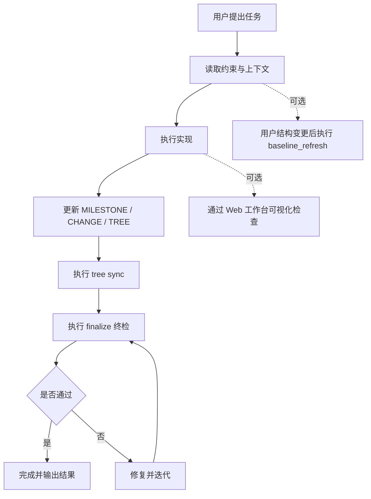

<div align="center">

<h1>AAAAAAGENTS.MD</h1>

<p><strong>把项目约束、里程碑、变更、目录和验证收进一套可执行、可追溯的协作工作区</strong></p>

<p>
  
  
  
  

</p>

<p>
  <a href="#project-snapshot">项目概览</a> ·
  <a href="AAAAAAGENTS.MD.CN/AGENTS.md">中文工作区</a> ·
  <a href="AAAAAAGENTS.MD.EN/AGENTS.md">英文工作区</a> ·
  <a href="CONTRIBUTING.md">贡献指南</a> ·
  <a href="LICENSE">许可证</a>
</p>

<p><a href="README.md">简体中文</a> · <a href="README.en.md">English</a></p>

</div>

<a id="project-snapshot"></a>

## 1 项目概览

本节把原有双语长文档拆成中文主文档和英文镜像，原有功能、流程、命令、截图槽位和采用边界继续保留

<div align="center">

表 1.1 项目公开概览

| 项目 | 当前内容 |
|---|---|
| 中文工作区 | `AAAAAAGENTS.MD.CN` |
| 英文工作区 | `AAAAAAGENTS.MD.EN` |
| 治理核心 | `AGENTS.md`、`MILESTONE.md`、`CHANGE.md` 和 `TREE.md` |
| 自动化 | 目录同步、基线刷新和最终校验 |
| 可视化 | 仓库内本地工作台，不依赖公开部署地址 |
| 许可证 | 见 [`LICENSE`](LICENSE) |

</div>

## 2 项目介绍

`AAAAAAGENTS.MD` 是一套面向 AI 协作开发的规则化治理工程
它由三部分组成：

- 约束文档体系（`AGENTS.md`、`MILESTONE.md`、`CHANGE.md`、`TREE.md`）
- 可重复执行的自动化脚本（`agents_tools`）
- 本地可视化工作台（`agents_web`）

中文工作区路径：`./AAAAAAGENTS.MD.CN`

## 3 治理目标

- 让 Agent 执行过程有边界、可追踪、可审计
- 把口头协作规则转成可执行校验
- 统一里程碑推进与变更记录方式
- 降低新项目初始化与交接成本
- 提升项目结构化认知颗粒度，做到 AI 可读、用户可读、协作过程可审计

## 4 运行方式

<div align="center">


```mermaid
%% 展示规则文档怎样驱动执行、记录和校验
flowchart TD
    A[用户提出任务] --> B[读取约束与上下文]
    B --> C[执行实现]
    C --> D[更新 MILESTONE / CHANGE / TREE]
    D --> E[执行 tree sync]
    E --> F[执行 finalize 终检]
    F --> G{是否通过}
    G -- 是 --> H[完成并输出结果]
    G -- 否 --> I[修复并迭代]
    I --> F
    B -. 可选 .-> J[用户结构变更后执行 baseline_refresh]
    C -. 可选 .-> K[通过 Web 工作台可视化检查]
```

图 4.1 规则文档、执行模式和校验闭环

</div>

## 5 提示词模板

### 5.1 初始化提示词

```markdown
# 将以下内容作为一段完整提示词使用
# 以下内容继续说明本段任务要求
先读取 `AGENTS.md`，再结合 `BACKGROUND.md`、`TREE.md` 与项目现有文件建立初始全局认知

# 以下内容继续说明本段任务要求
后续执行以 `AGENTS.md` 规定的工作流、记录格式、范围边界和校验规则为唯一标准来源
```

### 5.2 日常提示词

```markdown
# 将以下内容作为一段完整提示词使用
# 以下内容继续说明本段任务要求
请先定位本次任务对应的 `MILESTONE` 节点，再按 `AGENTS.md` 的标准工作流执行并完成更新记录与终检闭环

# 以下内容继续说明本段任务要求
用户不需要在 prompt 里展开细节，任务细则统一以 `AGENTS.md` 及相关约束文档为准
```

## 6 快速启用

```bash
# 中文工作区
cd AAAAAAGENTS.MD.CN # 执行本小节对应操作

# 启动本地可视化服务
python ./start_web.py # 执行本小节对应操作
# 或
./start_web.sh # 执行本小节对应操作
# 或（Windows）
./start_web.bat # 执行本小节对应操作

# 常用维护命令
python agents_tools/tree.py sync # 执行本小节对应操作
python agents_tools/baseline_refresh.py # 执行本小节对应操作
python agents_tools/verify_rules.py finalize --json # 执行本小节对应操作
```

## 7 屏幕截图

标准截图槽位（中文）：

- `01-overview.png`
- `02-milestone-flow.png`
- `03-tree-explorer.png`
- `04-edit-mode.png`
